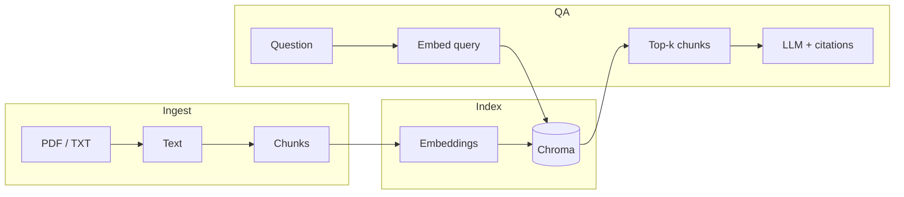

# ResearchAgent

Local **retrieval-augmented generation (RAG)** over research PDFs and text files. Ingest documents, embed chunks into a vector index, retrieve by semantic similarity, and answer questions **grounded in retrieved passages** with explicit source references.

The codebase is intentionally **small and inspectable**: straightforward to run, extend, and measure.

---

## What it does (today)

| Stage | Responsibility |
|--------|----------------|
| **Ingest** | Load `.txt` / `.pdf`, extract text, split into chunks |
| **Index** | Embed chunks (OpenAI), persist vectors in **Chroma** on disk |
| **Retrieve** | Embed the user question, return top‑*k* nearest chunks |
| **Answer** | Call a chat model with *only* those chunks as context; ask for citations (`[1]`, `[2]`, …) |

End-to-end entrypoint: `python -m src.main` (from the repository root).

---

## Architecture



**Design choices (intentional for V1)**

- **Character-based chunking** with overlap—simple and fast; token-aware chunking is on the roadmap.
- **Full index rebuild** on each run—correctness over incremental complexity; optional skip-rebuild is a follow-up.
- **Soft grounding** via prompt instructions; stricter citation contracts and eval harnesses are planned.

---

## Repository layout

```text
ResearchAgent/
├── README.md
├── requirements.txt
├── .env.example          # template; copy to .env — do not commit secrets
├── data/
│   ├── docs/             # input papers (.pdf, .txt)
│   └── index/            # Chroma persistence (gitignored)
└── src/
    ├── config.py         # paths, model names
    ├── ingest.py         # load + chunk
    ├── index.py          # embed + Chroma + query
    ├── qa.py             # RAG: retrieve → prompt → answer
    └── main.py           # CLI smoke test + debug prints
```

---

## Quick start

**1. Python:** 3.11+ recommended (3.13 works if dependencies install cleanly).

**2. Virtual environment**

```bash
python3 -m venv .venv
source .venv/bin/activate   # Windows: .venv\Scripts\activate
pip install -r requirements.txt
```

**3. API key**

```bash
cp .env.example .env
# In .env: OPENAI_API_KEY=sk-...  (embeddings + chat)
```

**4. Documents:** place PDFs and `.txt` files under `data/docs/`.

**5. Run** (from the repository root):

```bash
python -m src.main
```

Package imports require running as a module from the project root (`python -m src.main`), not `python src/main.py` from inside `src/`.

---

## Configuration

Key settings live in `src/config.py`:

- `DOCS_DIR` — input documents  
- `INDEX_DIR` — Chroma storage (`data/index/`, gitignored)  
- `DEFAULT_EMBEDDING_MODEL` — e.g. `text-embedding-3-small`  
- `DEFAULT_CHAT_MODEL` — chat model for grounded answers  

---

## Roadmap (near-term)

Prioritized for **signal over hype**:

1. **Token-aware chunking** (tiktoken) + paragraph-first splits → cleaner PDF chunks  
2. **Single retrieval per question** in `main` (avoid duplicate `query_index` calls)  
3. **Lightweight eval** — JSON question/ground-truth file + simple metrics  
4. **Streamlit UI** — upload / ask / show citations  
5. **arXiv integration** — fetch metadata (and optionally PDFs) with caching and rate limits  
6. **Docker** — repeatable containerized runs  

---

## What this project is / isn't

| Is | Isn't |
|----|--------|
| A credible **RAG systems** portfolio piece | A production SaaS |
| Easy to **extend and measure** | A framework dump |
| Honest about **V1 limitations** | “Solved AGI” marketing |

---

## License

Add an explicit license when publishing (e.g. MIT). Until then, default copyright applies unless stated otherwise.
