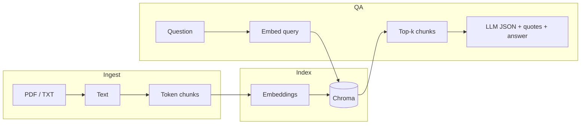

# ResearchAgent

Local **retrieval-augmented generation (RAG)** over research PDFs and plain text. Documents get chunked, embedded, and stored in **Chroma**; questions retrieve the nearest chunks and the chat model answers **from those passages**, with citations. I keep the layout flat so anyone can read the pipeline end to end without wading through frameworks.

There is a **Streamlit** chat UI (`app.py`) for demos, plus a small CLI path (`src/main.py`) and a **retrieval eval** script that writes JSON reports under `eval/reports/`.

---

## What it does

| Stage | What happens |
|--------|----------------|
| **Ingest** | Load `.txt` / `.pdf`, extract text, **token-aware** chunking (`tiktoken`, paragraph-first) |
| **Index** | Embed chunks with OpenAI, persist in **Chroma** on disk |
| **Retrieve** | Embed the question, return top‑*k* chunks by distance |
| **Answer** | Chat model gets numbered sources; it must return **structured JSON** with verbatim **supporting quotes** before the natural-language answer. If support is missing, the app shows a fixed “not found” message instead of guessing |

The QA layer supports two **grounding modes** in the UI: **Strict** (yes/no only when the text clearly supports it) and **Definition-based** (short answers from quoted definitions when an explicit yes/no is not in the sources). Both modes still require evidence in the JSON contract.

---

## Architecture



**Design choices (V1 on purpose)**

- **Token-aware chunking** with overlap — better alignment with model context than raw character windows.
- **Full index rebuild** when you re-index — simple and predictable; incremental updates can come later.
- **Evidence-first answers** — the model outputs quotes + citations in JSON; the UI still shows `[1][2]` style markers for readability.
- **Retrieval eval** — `Hit@k` and **MRR** over a hand-labeled `eval/questions.json` to see whether the right papers show up near the top (and to eyeball distance on the top hit).

---

## Repository layout

```text
ResearchAgent/
├── README.md
├── requirements.txt
├── app.py                 # Streamlit UI
├── .env.example
├── eval/
│   ├── questions.json     # eval questions + expected source filenames
│   └── reports/           # latest.json written by eval
├── data/
│   ├── docs/              # your papers (.pdf, .txt)
│   └── index/             # Chroma persistence (gitignored except README)
└── src/
    ├── config.py          # paths, model names, optional tuning constants
    ├── chunk.py           # token chunking
    ├── ingest.py          # load + chunk
    ├── index.py           # embed + Chroma + query
    ├── qa.py              # evidence-first RAG (JSON contract, policies)
    ├── eval.py            # retrieval metrics → eval/reports/latest.json
    └── main.py            # CLI smoke test
```

---

## Quick start

**Python:** 3.11+ is a safe bet.

**Environment**

```bash
python3 -m venv .venv
source .venv/bin/activate   # Windows: .venv\Scripts\activate
pip install -r requirements.txt
```

**API key**

```bash
cp .env.example .env
# Set OPENAI_API_KEY=sk-...  (embeddings + chat)
```

**Documents:** put PDFs and `.txt` files under `data/docs/`.

**CLI** (from repo root — use the module form so imports work):

```bash
python -m src.main
```

**Web UI**

```bash
streamlit run app.py
```

Use the sidebar to rebuild the index after adding papers, and pick the grounding mode before you ask.

**Retrieval eval** (needs an up-to-date index that matches your `eval/questions.json`):

```bash
python -m src.eval
```

Report: `eval/reports/latest.json`.

---

## Configuration

Main knobs live in `src/config.py`:

- `DOCS_DIR` / `INDEX_DIR` — input and Chroma paths  
- `DEFAULT_EMBEDDING_MODEL` — e.g. `text-embedding-3-small`  
- `DEFAULT_CHAT_MODEL` — chat model for answers  
- `RETRIEVAL_DISTANCE_THRESHOLD` — reserved for tuning / display; the current QA path is driven by the evidence JSON contract and policies above  

---

## License

No license file yet;
